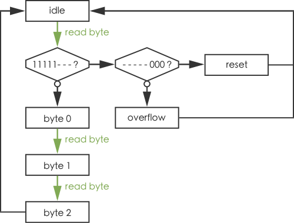

# Event Stream

Event Stream is a file format specification. It is meant as a standard for storing events streams, and can be used for transmitting events between electronic devices. The specification includes a versioning system, in order to allow massive changes while keeping backward compatibility. The recommanded extension for Event Stream files is *.es*.

# Binary file structure

Every Event Stream file starts with the following bytes:

| Position      | Content                                                                                      |
|:-------------:|:--------------------------------------------------------------------------------------------:|
| Bytes 0 to 11 | `0x45 0x76 0x65 0x6e 0x74 0x20 0x53 0x74 0x72 0x65 0x61 0x6d` (_Event Stream_ ascii-encoded) |
| Byte 12       | Major version number                                                                         |
| Byte 13       | Minor version number                                                                         |

Bytes from 14 to the end are version dependent. The content description for each version is given below.

## Version 0.1

The file can represent three types of streams: ATIS events, asynchronous screen events and color events. The type is stored in the byte 14:

| Byte 14 | Stream type                |
|:-------:|:--------------------------:|
| `0x00`  | ATIS events                |
| `0x01`  | Asynchronous screen events |
| `0x02`  | Color events               |

### ATIS events

Each byte from 15 to the end can be any of _byte 0_, _byte 1_, _byte 2_, _reset_ and _overflow_. The possible order of these bytes is given by the state machine:

The bytes encode the following data:

| Byte name | Bits                                                                                   |
|:---------:|:--------------------------------------------------------------------------------------:|
| _byte 0_  | timestamp[0], timestamp[1], timestamp[2], timestamp[3], timestamp[4], x[0], x[1], x[2] |
| _byte 1_  | x[3], x[4], x[5], x[6], x[7], x[8], y[0], y[1]                                         |
| _byte 2_  | y[2], y[3], y[4], y[5], y[6], y[7], isExposureMeasurement, polarity                    |

### Asynchronous screen events

Each byte from 15 to the end can be any of _byte 0_, _byte 1_, _byte 2_, _reset_ and _overflow_. The possible order of these bytes is given by the state machine:

The bytes encode the following data:

| Byte name | Bits                                                                                   |
|:---------:|:--------------------------------------------------------------------------------------:|
| _byte 0_  | timestamp[0], timestamp[1], timestamp[2], timestamp[3], timestamp[4], x[0], x[1], x[2] |
| _byte 1_  | fpga[0], fpga[1], fpga[2], fpga[3], fpga[4], fpga[5], fpga[6], fpga[7]                 |
| _byte 2_  | y[0], y[1], y[2], intensity[0], intensity[1], intensity[2], intensity[3], intensity[4] |

# License

See the [LICENSE](LICENSE.md) file for license rights and limitations (MIT).
