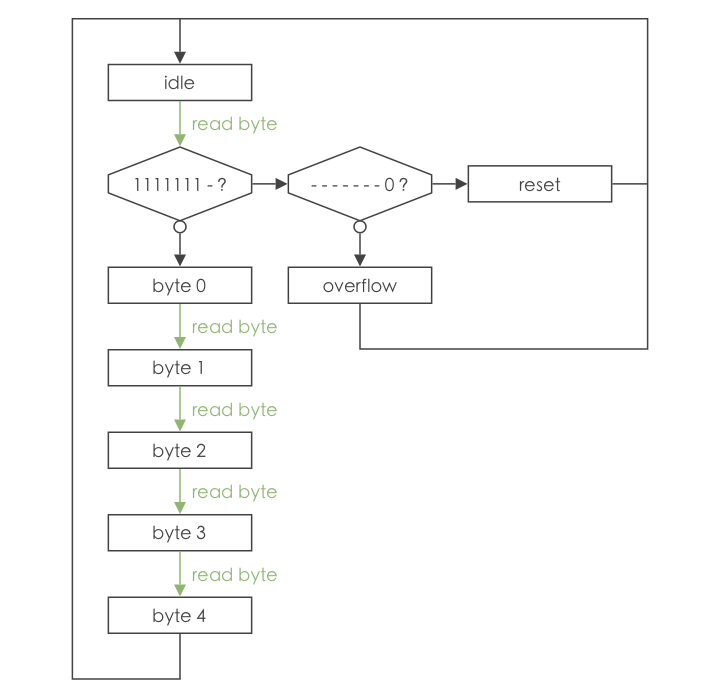
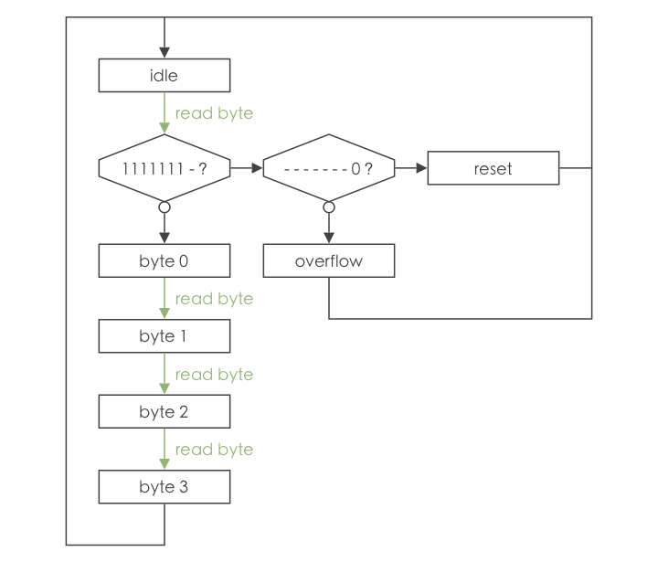
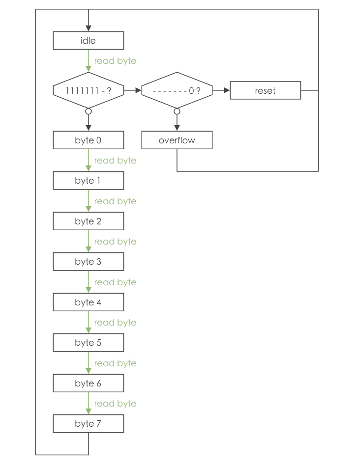

# Event Stream

Event Stream is a file format specification. It is meant as a standard for storing events streams, and can be used for transmitting events between electronic devices. The specification includes a versioning system, in order to allow massive changes while keeping backward compatibility. The recommended extension for Event Stream files is __.es__.

For a byte `b`, `b[0]` denotes the LSB (least significant bit) and `b[7]` denotes the MSB (most significant bit).

# Binary file structure

Every Event Stream file starts with a 15 bytes header:

| Position      | Content                                                                                      |
|:-------------:|:--------------------------------------------------------------------------------------------:|
| Bytes 0 to 11 | `0x45 0x76 0x65 0x6e 0x74 0x20 0x53 0x74 0x72 0x65 0x61 0x6d` (_Event Stream_ ASCII-encoded) |
| Byte 12       | Major version                                                                                |
| Byte 13       | Minor version                                                                                |
| Byte 14       | Patch version                                                                                |

Version numbering follows the [Semantic Versioning](https://semver.org) convention. Bytes 15 to the end are version dependent. The content description is given below.

## Version 2.0

The file can represent five types of streams: generic events, DVS events, ATIS events, Asynchronous & Modular Display events and color events. The type is stored in byte 15:

| Byte 15 | Stream type                           |
|:-------:|:-------------------------------------:|
| `0x00`  | Generic events                        |
| `0x01`  | DVS events                            |
| `0x02`  | ATIS events                           |
| `0x03`  | Asynchronous & Modular Display events |
| `0x04`  | Color events                          |

### Generic events

Bytes 16 to the end can be any of _reset_, _overflow_, _byte 0_, _size byte_ and _data byte_. The possible order of these bytes is given by the state machine:


The bytes encode the following data:

| Byte name   | MSB    | Bit 6  | Bit 5  | Bit 4  | Bit 3  | Bit 2  | Bit 1  | LSB       |
|:-----------:|:------:|:------:|:------:|:------:|:------:|:------:|:------:|:---------:|
| _reset_     | `1`    | `1`    | `1`    | `1`    | `1`    | `1`    | `1`    | `0`       |
| _overflow_  | `1`    | `1`    | `1`    | `1`    | `1`    | `1`    | `1`    | `1`       |
| _byte 0_    | `t[7]` | `t[6]` | `t[5]` | `t[4]` | `t[3]` | `t[2]` | `t[1]` | `t[0]`    |
| _size byte_ | `s[6]` | `s[5]` | `s[4]` | `s[3]` | `s[2]` | `s[1]` | `s[0]` | `is_last` |
| _data byte_ | `d[7]` | `d[6]` | `d[5]` | `d[4]` | `d[3]` | `d[2]` | `d[1]` | `d[0]`    |


_reset_ is a special byte inserted when deemed necessary to correct state machine errors resulting from bit errors.

_t_ encodes the time elapsed since the previous event in microseconds, and cannot be `0b11111110` nor `0b11111111`. If this time is equal to or larger than `0b11111110` microseconds, one or several _overflow_ bytes are inserted before the event. The actual time elapsed since the last event can be computed as the current event's timestamp plus `0b11111110` microseconds multiplied by the number of _overflow_ bytes.

Each event's data payload starts with one or several size bytes, which encodes the number of data bytes to be read. The number `n` of data bytes to read is given by:
```
n = ∑ (s_i) << (7 * i)
```
where `s_i, i ∈ [0, k - 1]` denotes the (i + 1)th `s` value, and `k` the number of size bytes. The minimum number of size bytes depends on the number of data bytes. Events of the same stream can have different numbers of data bytes and different numbers of size bytes. `n` data bytes require at least `Γlb(n + 1) / 7⅂` size bytes, where `Γ…⅂` is the ceil function and `lb(…)` is the binary logarithm. Applications or devices generating generic events are encouraged to use this minimal number, though the Event Stream specification allows a larger number of size bytes.

`is_last` equals `0` for the last size byte before data bytes, and `1` otherwise.

`d` encodes user-provided data.

### DVS events

Bytes 16 to 19 encode the sensor's width and height:

| Byte name | MSB     | Bit 6   | Bit 5   | Bit 4   | Bit 3   | Bit 2   | Bit 1  | LSB    |
|:---------:|:-------:|:-------:|:-------:|:-------:|:-------:|:-------:|:------:|:------:|
| byte 16   | `w[7]`  | `w[6]`  | `w[5]`  | `w[4]`  | `w[3]`  | `w[2]`  | `w[1]` | `w[0]` |
| byte 17   | `w[15]` | `w[14]` | `w[13]` | `w[12]` | `w[11]` | `w[10]` | `w[9]` | `w[8]` |
| byte 18   | `h[7]`  | `h[6]`  | `h[5]`  | `h[4]`  | `h[3]`  | `h[2]`  | `h[1]` | `h[0]` |
| byte 19   | `h[15]` | `h[14]` | `h[13]` | `h[12]` | `h[11]` | `h[10]` | `h[9]` | `h[8]` |

`w` (respectively `h`) encodes the sensor's width (respectively height). An event's x (respectively y) coordinate must be in the integer range `[0, w - 1]` (respectively `[0, h - 1]`).

Bytes 20 to the end can be any of _reset_, _overflow_, _byte 0_, _byte 1_, _byte 2_, _byte 3_ and _byte 4_. The possible order of these bytes is given by the state machine:



The bytes encode the following data:

| Byte name  | MSB     | Bit 6   | Bit 5   | Bit 4   | Bit 3   | Bit 2   | Bit 1  | LSB           |
|:----------:|:-------:|:-------:|:-------:|:-------:|:-------:|:-------:|:------:|:-------------:|
| _reset_    | `1`     | `1`     | `1`     | `1`     | `1`     | `1`     | `1`    | `0`           |
| _overflow_ | `1`     | `1`     | `1`     | `1`     | `1`     | `1`     | `1`    | `1`           |
| _byte 0_   | `t[6]`  | `t[5]`  | `t[4]`  | `t[3]`  | `t[2]`  | `t[1]`  | `t[0]` | `is_increase` |
| _byte 1_   | `x[7]`  | `x[6]`  | `x[5]`  | `x[4]`  | `x[3]`  | `x[2]`  | `x[1]` | `x[0]`        |
| _byte 2_   | `x[15]` | `x[14]` | `x[13]` | `x[12]` | `x[11]` | `x[10]` | `x[9]` | `x[8]`        |
| _byte 3_   | `y[7]`  | `y[6]`  | `y[5]`  | `y[4]`  | `y[3]`  | `y[2]`  | `y[1]` | `y[0]`        |
| _byte 4_   | `y[15]` | `y[14]` | `y[13]` | `y[12]` | `y[11]` | `y[10]` | `y[9]` | `y[8]`        |

_reset_ is a special event inserted when deemed necessary to correct state machine errors resulting from bit errors. _reset_ bytes should be inserted five at a time, so that at least one byte is read while in _idle_ state.

`t` encodes the time elapsed since the previous event in microseconds, and cannot be `0b1111111`. If this time is equal or larger than `0b1111111` microseconds, one or several _overflow_ bytes are inserted before the event. The actual time elapsed since the last event can be computed as the current event's timestamp plus `0b1111111` microseconds multiplied by the number of _overflow_ bytes.

`is_increase` equals `1` for light increase events, and `0` otherwise.

`x` and `y` encode the pixel coordinates associated with the event.

### ATIS events

Bytes 16 to 19 encode the sensor's width and height:

| Byte name | MSB     | Bit 6   | Bit 5   | Bit 4   | Bit 3   | Bit 2   | Bit 1  | LSB    |
|:---------:|:-------:|:-------:|:-------:|:-------:|:-------:|:-------:|:------:|:------:|
| byte 16   | `w[7]`  | `w[6]`  | `w[5]`  | `w[4]`  | `w[3]`  | `w[2]`  | `w[1]` | `w[0]` |
| byte 17   | `w[15]` | `w[14]` | `w[13]` | `w[12]` | `w[11]` | `w[10]` | `w[9]` | `w[8]` |
| byte 18   | `h[7]`  | `h[6]`  | `h[5]`  | `h[4]`  | `h[3]`  | `h[2]`  | `h[1]` | `h[0]` |
| byte 19   | `h[15]` | `h[14]` | `h[13]` | `h[12]` | `h[11]` | `h[10]` | `h[9]` | `h[8]` |

`w` (respectively `h`) encodes the sensor's width (respectively height). An event's x (respectively y) coordinate must be in the integer range `[0, w - 1]` (respectively `[0, h - 1]`).

Bytes 20 to the end can be any of _reset_, _overflow_, _byte 0_, _byte 1_, _byte 2_, _byte 3_ and _byte 4_. The possible order of these bytes is given by the state machine:


The bytes encode the following data:

| Byte name  | MSB     | Bit 6   | Bit 5   | Bit 4   | Bit 3   | Bit 2   | Bit 1         | LSB           |
|:----------:|:-------:|:-------:|:-------:|:-------:|:-------:|:-------:|:-------------:|:-------------:|
| _reset_    | `1`     | `1`     | `1`     | `1`     | `1`     | `1`     | `0`           | `0`           |
| _overflow_ | `1`     | `1`     | `1`     | `1`     | `1`     | `1`     | `overflow[1]` | `overflow[0]` |       
| _byte 0_   | `t[5]`  | `t[4]`  | `t[3]`  | `t[2]`  | `t[1]`  | `t[0]`  | `polarity`    | `is_tc`       |
| _byte 1_   | `x[7]`  | `x[6]`  | `x[5]`  | `x[4]`  | `x[3]`  | `x[2]`  | `x[1]`        | `x[0]`        |
| _byte 2_   | `x[15]` | `x[14]` | `x[13]` | `x[12]` | `x[11]` | `x[10]` | `x[9]`        | `x[8]`        |
| _byte 3_   | `y[7]`  | `y[6]`  | `y[5]`  | `y[4]`  | `y[3]`  | `y[2]`  | `y[1]`        | `y[0]`        |
| _byte 4_   | `y[15]` | `y[14]` | `y[13]` | `y[12]` | `y[11]` | `y[10]` | `y[9]`        | `y[8]`        |

_reset_ is a special event inserted when deemed necessary to correct state machine errors resulting from bit errors. _reset_ bytes should be inserted five at a time, so that at least one byte is read while in _idle_ state.

`t` encodes the time elapsed since the previous event in microseconds, and cannot be `0b111111`. If this time is equal or larger than `0b111111` microseconds, one or several _overflow_ bytes are inserted before the event. The actual time elapsed since the last event can be computed as the current event's timestamp plus `0b111111` microseconds multiplied by the number encoded by `overflow[0]`, `overflow[1]` for each _overflow_ event.

`is_tc` equals `0` for a DVS event, and `1` for a threshold crossing (half an exposure measurement). `polarity` stores `is_increase` for a DVS event, and `is_second` for threshold crossing.

`x` and `y` encode the pixel coordinates associated with the event.

### Asynchronous & Modular Display events

Bytes 16 to the end can be any of _reset_, _overflow_, _byte 0_, _byte 1_, _byte 2_ and _byte_3_. The possible order of these bytes is given by the state machine:



The bytes encode the following data:

| Byte name  | MSB    | Bit 6  | Bit 5   | Bit 4   | Bit 3   | Bit 2   | Bit 1  | LSB    |
|:----------:|:------:|:------:|:-------:|:-------:|:-------:|:-------:|:------:|:------:|
| _reset_    | `1`    | `1`    | `1`     | `1`     | `1`     | `1`     | `1`    | `0`    |
| _overflow_ | `1`    | `1`    | `1`     | `1`     | `1`     | `1`     | `1`    | `1`    |
| _byte 0_   | `t[7]` | `t[6]` | `t[5]`  | `t[4]`  | `t[3]`  | `t[2]`  | `t[1]` | `t[0]` |
| _byte 1_   | `x[7]` | `x[6]` | `x[5]`  | `x[4]`  | `x[3]`  | `x[2]`  | `x[1]` | `x[0]` |
| _byte 2_   | `y[7]` | `y[6]` | `y[5]`  | `y[4]`  | `y[3]`  | `y[2]`  | `y[1]` | `y[0]` |
| _byte 3_   | `s[7]` | `s[6]` | `s[5]`  | `s[4]`  | `s[3]`  | `s[2]`  | `s[1]` | `s[0]` |

_reset_ is a special event inserted when deemed necessary to correct state machine errors resulting from bit errors. _reset_ bytes should be inserted four at a time, so that at least one byte is read while in _idle_ state.

`t` encodes the time elapsed since the previous event in microseconds, and cannot be `0b11111110` nor `0b11111111`. If this time is equal to or larger than `0b11111110` microseconds, one or several _overflow_ bytes are inserted before the event. The actual time elapsed since the last event can be computed as the current event's timestamp plus `0b11111110` microseconds multiplied by the number of _overflow_ bytes.

`x` and `y` encode the pixel coordinates associated with the event.

`s` encodes the current stage in the pyramid. Outside the display, its value should be `0b00000000` (see Asynchronous & modular display documentation for details).

### Color events

Bytes 16 to 19 encode the sensor's width and height:

| Byte name | MSB     | Bit 6   | Bit 5   | Bit 4   | Bit 3   | Bit 2   | Bit 1  | LSB    |
|:---------:|:-------:|:-------:|:-------:|:-------:|:-------:|:-------:|:------:|:------:|
| byte 16   | `w[7]`  | `w[6]`  | `w[5]`  | `w[4]`  | `w[3]`  | `w[2]`  | `w[1]` | `w[0]` |
| byte 17   | `w[15]` | `w[14]` | `w[13]` | `w[12]` | `w[11]` | `w[10]` | `w[9]` | `w[8]` |
| byte 18   | `h[7]`  | `h[6]`  | `h[5]`  | `h[4]`  | `h[3]`  | `h[2]`  | `h[1]` | `h[0]` |
| byte 19   | `h[15]` | `h[14]` | `h[13]` | `h[12]` | `h[11]` | `h[10]` | `h[9]` | `h[8]` |

`w` (respectively `h`) encodes the sensor's width (respectively height). An event's x (respectively y) coordinate must be in the integer range `[0, w - 1]` (respectively `[0, h - 1]`).

Bytes 20 to the end can be any of _reset_, _overflow_, _byte 0_, _byte 1_, _byte 2_, _byte 3_, _byte 4_, _byte 5_, _byte 6_ and _byte 7_. The possible order of these bytes is given by the state machine:



The bytes encode the following data:

| Byte name  | MSB     | Bit 6   | Bit 5   | Bit 4   | Bit 3   | Bit 2   | Bit 1  | LSB    |
|:----------:|:-------:|:-------:|:-------:|:-------:|:-------:|:-------:|:------:|:------:|
| _reset_    | `1`     | `1`     | `1`     | `1`     | `1`     | `1`     | `1`    | `0`    |
| _overflow_ | `1`     | `1`     | `1`     | `1`     | `1`     | `1`     | `1`    | `1`    |
| _byte 0_   | `t[7]`  | `t[6]`  | `t[5]`  | `t[4]`  | `t[3]`  | `t[2]`  | `t[1]` | `t[0]` |
| _byte 1_   | `x[7]`  | `x[6]`  | `x[5]`  | `x[4]`  | `x[3]`  | `x[2]`  | `x[1]` | `x[0]` |
| _byte 2_   | `x[15]` | `x[14]` | `x[13]` | `x[12]` | `x[11]` | `x[10]` | `x[9]` | `x[8]` |
| _byte 3_   | `y[7]`  | `y[6]`  | `y[5]`  | `y[4]`  | `y[3]`  | `y[2]`  | `y[1]` | `y[0]` |
| _byte 4_   | `y[15]` | `y[14]` | `y[13]` | `y[12]` | `y[11]` | `y[10]` | `y[9]` | `y[8]` |
| _byte 5_   | `r[7]`  | `r[6]`  | `r[5]`  | `r[4]`  | `r[3]`  | `r[2]`  | `r[1]` | `r[0]` |
| _byte 6_   | `g[7]`  | `g[6]`  | `g[5]`  | `g[4]`  | `g[3]`  | `g[2]`  | `g[1]` | `g[0]` |
| _byte 7_   | `b[7]`  | `b[6]`  | `b[5]`  | `b[4]`  | `b[3]`  | `b[2]`  | `b[1]` | `b[0]` |

_reset_ is a special event inserted when deemed necessary to correct state machine errors resulting from bit errors. _reset_ bytes should be inserted height at a time, so that at least one byte is read while in _idle_ state.

`t` encodes the time elapsed since the previous event in microseconds, and cannot be `0b11111110` nor `0b11111111`. If this time is equal to or larger than `0b11111110` microseconds, one or several _overflow_ bytes are inserted before the event. The actual time elapsed since the last event can be computed as the current event's timestamp plus `0b11111110` microseconds multiplied by the number of _overflow_ bytes.

`x` and `y` encode the pixel coordinates associated with the event.

`r`, `g` and `b` encode the red, green and blue color components.

# License

See the [LICENSE](LICENSE.txt) file for license rights and limitations (GNU GPLv3).
