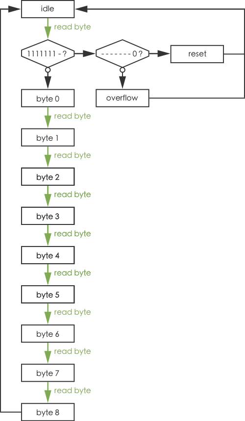
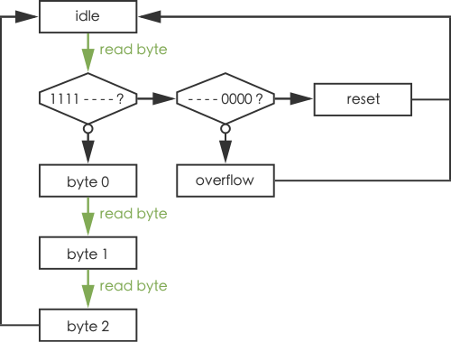
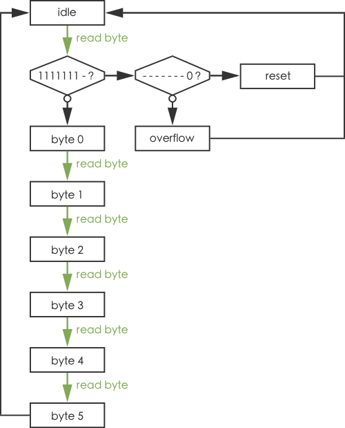

# Event Stream

Event Stream is a file format specification. It is meant as a standard for storing events streams, and can be used for transmitting events between electronic devices. The specification includes a versioning system, in order to allow massive changes while keeping backward compatibility. The recommended extension for Event Stream files is *.es*. For a byte `b`, `b[0]` denotes the LSB (least significant bit) and `b[7]` denotes the MSB (most significant bit).

# Binary file structure

Every Event Stream file starts with a 15 bytes header:

| Position      | Content                                                                                      |
|:-------------:|:--------------------------------------------------------------------------------------------:|
| Bytes 0 to 11 | `0x45 0x76 0x65 0x6e 0x74 0x20 0x53 0x74 0x72 0x65 0x61 0x6d` (_Event Stream_ ASCII-encoded) |
| Byte 12       | Major version                                                                                |
| Byte 13       | Minor version                                                                                |
| Byte 14       | Patch version                                                                                |

Version numbering follows the [Semantic Versioning](https://semver.org) convention. Bytes 15 to the end are version dependent. The content description is given below.

## Version 2.0

The file can represent five types of streams: DVS events, ATIS events, Asynchronous & Modular Display events, color events and generic events. The type is stored in byte 15:

| Byte 15 | Stream type                           |
|:-------:|:-------------------------------------:|
| `0x00`  | Generic events                        |
| `0x01`  | DVS events                            |
| `0x02`  | ATIS events                           |
| `0x03`  | Asynchronous & Modular Display events |
| `0x04`  | Color events                          |
| `0x05`  | Liquid events                         |

### Generic events

Bytes 16 to the end can be any of _byte 0_, _byte 1_, _byte 2_, _byte 3_, _byte 4_, _byte 5_, _byte 6_, _byte 7_, _byte 8_, _reset_ and _overflow_. The possible order of these bytes is given by the state machine:

The bytes encode the following data:

| Byte name  | MSB        | Bit 6      | Bit 5      | Bit 4      | Bit 3      | Bit 2      | Bit 1      | LSB        |
|:----------:|:----------:|:----------:|:----------:|:----------:|:----------:|:----------:|:----------:|:----------:|
| _byte 0_   | `extraBit` | `t[6]`     | `t[5]`     | `t[4]`     | `t[3]`     | `t[2]`     | `t[1]`     | `t[0]`     |
| _byte 1_   | `data[7]`  | `data[6]`  | `data[5]`  | `data[4]`  | `data[3]`  | `data[2]`  | `data[1]`  | `data[0]`  |
| _byte 2_   | `data[15]` | `data[14]` | `data[13]` | `data[12]` | `data[11]` | `data[10]` | `data[9]`  | `data[8]`  |
| _byte 3_   | `data[23]` | `data[22]` | `data[21]` | `data[20]` | `data[19]` | `data[18]` | `data[17]` | `data[16]` |
| _byte 4_   | `data[31]` | `data[30]` | `data[29]` | `data[28]` | `data[27]` | `data[26]` | `data[25]` | `data[24]` |
| _byte 5_   | `data[39]` | `data[38]` | `data[37]` | `data[36]` | `data[35]` | `data[34]` | `data[33]` | `data[32]` |
| _byte 6_   | `data[47]` | `data[46]` | `data[45]` | `data[44]` | `data[43]` | `data[42]` | `data[41]` | `data[40]` |
| _byte 7_   | `data[55]` | `data[54]` | `data[53]` | `data[52]` | `data[51]` | `data[50]` | `data[49]` | `data[48]` |
| _byte 8_   | `data[63]` | `data[62]` | `data[61]` | `data[60]` | `data[59]` | `data[58]` | `data[57]` | `data[56]` |
| _reset_    | `0`        | `1`        | `1`        | `1`        | `1`        | `1`        | `1`        | `1`        |
| _overflow_ | `1`        | `1`        | `1`        | `1`        | `1`        | `1`        | `1`        | `1`        |

_reset_ is a special event inserted when deemed necessary to correct state machine errors resulting from bit errors. _reset_ events are always sent six-by-six, to make sure that at least the sixth _reset_ is read while in _idle_ state.

_t_ encodes the time elapsed since the previous event in microseconds, and cannot be `0b1111111`. If this time is equal or larger than `0b1111111` microseconds, one or several _overflow_ events are inserted before the event. The actual time elapsed since the last event can be computed as the current event's timestamp plus `0b1111111` microseconds multiplied by the number of _overflow_ events.

### DVS events

Bytes 16 to the end can be any of _byte 0_, _byte 1_, _byte 2_, _reset_ and _overflow_. The possible order of these bytes is given by the state machine:

The bytes encode the following data:

| Byte name  | MSB           | Bit 6         | Bit 5         | Bit 4         | Bit 3  | Bit 2  | Bit 1  | LSB    |
|:----------:|:-------------:|:-------------:|:-------------:|:-------------:|:------:|:------:|:------:|:------:|
| _byte 0_   | `x[3]`        | `x[2]`        | `x[1]`        | `x[0]`        | `t[3]` | `t[2]` | `t[1]` | `t[0]` |
| _byte 1_   | `y[1]`        | `y[0]`        | `x[9]`        | `x[8]`        | `x[7]` | `x[6]` | `x[5]` | `x[4]` |
| _byte 2_   | `isIncrease`  | `y[8]`        | `y[7]`        | `y[6]`        | `y[5]` | `y[4]` | `y[3]` | `y[2]` |
| _reset_    | `0`           | `0`           | `0`           | `0`           | `1`    | `1`    | `1`    | `1`    |
| _overflow_ | `overflow[3]` | `overflow[2]` | `overflow[1]` | `overflow[0]` | `1`    | `1`    | `1`    | `1`    |

_reset_ is a special event inserted when deemed necessary to correct state machine errors resulting from bit errors. _reset_ events are always sent three-by-three, to make sure that at least the third _reset_ is read while in _idle_ state.

_t_ encodes the time elapsed since the previous event in microseconds, and cannot be `0b1111`. If this time is equal or larger than `0b1111` microseconds, one or several _overflow_ events are inserted before the event. The actual time elapsed since the last event can be computed as the current event's timestamp plus `0b1111` microseconds multiplied by the number represented by `overflow[0]`, `overflow[1]`, `overflow[2]`, `overflow[3]` for each _overflow_ event.

### ATIS events

Bytes 16 to the end can be any of _byte 0_, _byte 1_, _byte 2_, _reset_ and _overflow_. The possible order of these bytes is given by the state machine:

The bytes encode the following data:

| Byte name  | MSB           | Bit 6                   | Bit 5         | Bit 4  | Bit 3  | Bit 2  | Bit 1  | LSB    |
|:----------:|:-------------:|:-----------------------:|:-------------:|:------:|:------:|:------:|:------:|:------:|
| _byte 0_   | `x[2]`        | `x[1]`                  | `x[0]`        | `t[4]` | `t[3]` | `t[2]` | `t[1]` | `t[0]` |
| _byte 1_   | `y[1]`        | `y[0]`                  | `x[8]`        | `x[7]` | `x[6]` | `x[5]` | `x[4]` | `x[3]` |
| _byte 2_   | `polarity`    | `is_threshold_crossing` | `y[7]`        | `y[6]` | `y[5]` | `y[4]` | `y[3]` | `y[2]` |
| _reset_    | `0`           | `0`                     | `0`           | `1`    | `1`    | `1`    | `1`    | `1`    |
| _overflow_ | `overflow[2]` | `overflow[1]`           | `overflow[0]` | `1`    | `1`    | `1`    | `1`    | `1`    |

_reset_ is a special event inserted when deemed necessary to correct state machine errors resulting from bit errors. _reset_ events are always sent three-by-three, to make sure that at least the third _reset_ is read while in _idle_ state.

_timestamp_ encodes the time elapsed since the previous event in microseconds, and cannot be `0b11111`. If this time is equal or larger than `0b11111` microseconds, one or several _overflow_ events are inserted before the event. The actual time elapsed since the last event can be computed as the current event's timestamp plus `0b11111` microseconds multiplied by the number represented by `overflow[0]`, `overflow[1]`, `overflow[2]` for each _overflow_ event.

### Asynchronous & Modular Display events

Bytes 16 to the end can be any of _byte 0_, _byte 1_, _byte 2_, _reset_ and _overflow_. The possible order of these bytes is given by the state machine:

The bytes encode the following data:

| Byte name  | Bits                                                                                                   |
|:----------:|:------------------------------------------------------------------------------------------------------:|
| _byte 0_   | `timestamp[7]`, `timestamp[6]`, `timestamp[5]`, `timestamp[4]`, `timestamp[3]`, `timestamp[2]`, `timestamp[1]`, `timestamp[0]` |
| _byte 1_   | `x[7]`, `x[6]`, `x[5]`, `x[4]`, `x[3]`, `x[2]`, `x[1]`, `x[0]` |
| _byte 2_   | `y[7]`, `y[6]`, `y[5]`, `y[4]`, `y[3]`, `y[2]`, `y[1]`, `y[0]` |
| _byte 3_   | `stage[2]`, `stage[1]`, `stage[0]`, `intensity[4]`, `intensity[3]`, `intensity[2]`, `intensity[1]`, `intensity[0]` |
| _reset_    | `timestamp = 0b11111111` |
| _overflow_ | `timestamp = 0b11111110` |

_stage_ encodes the current level in the pyramid ; by default and outside the display its value should be `0b000` (see asynchronous and modular display documentation for more details).

_reset_ is a special event inserted when deemed necessary to correct state machine errors resulting from bit errors. _reset_ events are always sent three-by-three, to make sure that at least the third _reset_ is read while in _idle_ state.
_Note: for the time being a reset is a single 4-bytes event with a timestamp value of `0b11111111` (see asynchronous and modular display documentation for more details)._

_timestamp_ encodes the time elapsed since the previous event in microseconds, and cannot be `0b11111110`. If this time is equal or larger than `0b11111110` microseconds, one or several _overflow_ events are inserted before the event.

### Color events

Bytes 16 to the end can be any of _byte 0_, _byte 1_, _byte 2_, _byte 3_, _byte 4_, _byte 5_, _reset_ and _overflow_. The possible order of these bytes is given by the state machine:

The bytes encode the following data:

| Byte name  | MSB    | Bit 6  | Bit 5  | Bit 4  | Bit 3  | Bit 2  | Bit 1  | LSB    |
|:----------:|:------:|:------:|:------:|:------:|:------:|:------:|:------:|:------:|
| _byte 0_   | `x[0]` | `t[6]` | `t[5]` | `t[4]` | `t[3]` | `t[2]` | `t[1]` | `t[0]` |
| _byte 1_   | `x[8]` | `x[7]` | `x[6]` | `x[5]` | `x[4]` | `x[3]` | `x[2]` | `x[1]` |
| _byte 2_   | `y[7]` | `y[6]` | `y[5]` | `y[4]` | `y[3]` | `y[2]` | `y[1]` | `y[0]` |
| _byte 3_   | `r[7]` | `r[6]` | `r[5]` | `r[4]` | `r[3]` | `r[2]` | `r[1]` | `r[0]` |
| _byte 4_   | `g[7]` | `g[6]` | `g[5]` | `g[4]` | `g[3]` | `g[2]` | `g[1]` | `g[0]` |
| _byte 5_   | `b[7]` | `b[6]` | `b[5]` | `b[4]` | `b[3]` | `b[2]` | `b[1]` | `b[0]` |
| _reset_    | `0`    | `1`    | `1`    | `1`    | `1`    | `1`    | `1`    | `1`    |
| _overflow_ | `1`    | `1`    | `1`    | `1`    | `1`    | `1`    | `1`    | `1`    |

_reset_ is a special event inserted when deemed necessary to correct state machine errors resulting from bit errors. _reset_ events are always sent six-by-six, to make sure that at least the sixth _reset_ is read while in _idle_ state.

_t_ encodes the time elapsed since the previous event in microseconds, and cannot be `0b1111111`. If this time is equal or larger than `0b1111111` microseconds, one or several _overflow_ events are inserted before the event. The actual time elapsed since the last event can be computed as the current event's timestamp plus `0b1111111` microseconds multiplied by the number of _overflow_ events.

### Liquid events

Bytes 16 to the end can be any of _byte 0_, _byte 1_, _byte 2_, _byte 3_, _byte 4_, _byte 5_, _byte 6_, _byte 7_, _byte 8_, _reset_ and _overflow_. The possible order of these bytes is given by the state machine:

The bytes encode the following data:

| Byte name  | MSB           | Bit 6         | Bit 5         | Bit 4  | Bit 3  | Bit 2  | Bit 1  | LSB    |
|:----------:|:-------------:|:-------------:|:-------------:|:------:|:------:|:------:|:------:|:------:|
| _byte 0_   | `p[3]`        | `p[1]`        | `p[0]`        | `t[4]` | `t[3]` | `t[2]` | `t[1]` | `t[0]` |
| _byte 1_   | `x[7]`        | `x[6]`        | `x[5]`        | `x[4]` | `x[3]` | `x[2]` | `x[1]` | `x[0]` |
| _byte 2_   | `y[7]`        | `y[6]`        | `y[5]`        | `y[4]` | `y[3]` | `y[2]` | `y[1]` | `y[0]` |
| _byte 3_   | `z[7]`        | `z[6]`        | `z[5]`        | `z[4]` | `z[3]` | `z[2]` | `z[1]` | `z[0]` |
| _reset_    | `0`           | `0`           | `0`           | `1`    | `1`    | `1`    | `1`    | `1`    |
| _overflow_ | `overflow[2]` | `overflow[1]` | `overflow[0]` | `1`    | `1`    | `1`    | `1`    | `1`    |

_reset_ is a special event inserted when deemed necessary to correct state machine errors resulting from bit errors. _reset_ events are always sent four-by-four, to make sure that at least the fourth _reset_ is read while in _idle_ state.

_t_ encodes the time elapsed since the previous event in microseconds, and cannot be `0b1111111`. If this time is equal or larger than `0b1111111` microseconds, one or serveral _overflow_ events are inserted before the event. The actual time elapsed since the last event can be computed as the current event's timestamp plus `0b1111111` microseconds multiplied by the number of _overflow_ events.

# License

See the [LICENSE](LICENSE.txt) file for license rights and limitations (GNU GPLv3).
